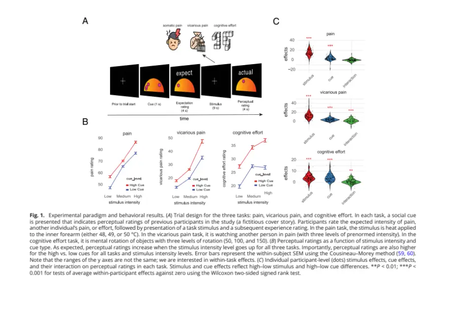
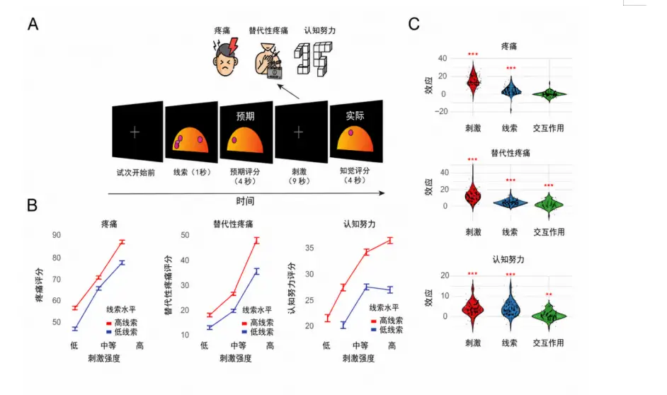

# Example: figure-interior localization and reference navigation

This example uses Figure 1 from Yazdanpanah et al. (2026). The Chinese version replaces semantic English text **inside the figure at its original positions** while preserving the data, axes, colors, error bars, significance marks, panel labels, and layout.

## Original English figure

## Chinese-localized figure

This is the required result: the image itself is re-rendered, and the Chinese labels cover and replace the original English labels. Merely adding a translated caption or a label-mapping table below an unchanged English figure does not satisfy the skill.

## Finding cited literature in Word or WPS

The generated DOCX uses native internal hyperlinks and DOI links.

1. Hold **Ctrl** and click the citation number with the **left mouse button** (for example, **Ctrl + left-click [1]**). Word or WPS should jump to the matching entry in the reference list.
2. Hold **Ctrl** and left-click the DOI in the reference entry. This opens the official DOI landing page at `https://doi.org/...`.
3. If the application is configured to open hyperlinks with a single click, Ctrl may not be required.
4. If a link is unavailable, press **Ctrl + F** and search the DOI, exact paper title, author surname, or reference number.
5. Use lawful full-text routes such as the publisher page, PubMed Central, an institutional subscription, a preprint, or an author manuscript.

## Reference

[1] Yazdanpanah, A., Jung, H., Soltani, A., & Wager, T. D. (2026). Social information creates self-fulfilling prophecies in judgments of pain, vicarious pain, and cognitive effort. *Proceedings of the National Academy of Sciences of the United States of America, 123*(7), e2513856123. https://doi.org/10.1073/pnas.2513856123

The source article is open access under CC BY 4.0. The reproduced figure is presented as a translation/localization example with attribution.
